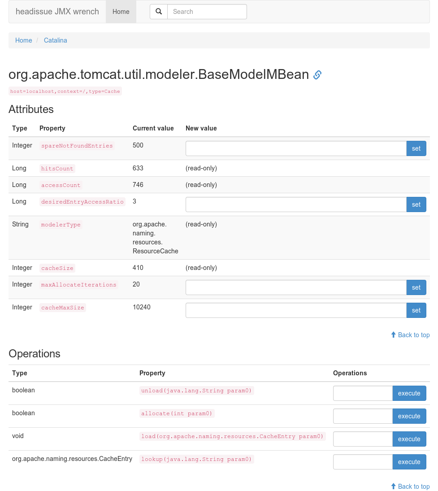

# jmx-wrench

A remote management tool for Managed Beans. Developed with the intention to be small and easy to use. Use Maven with "mvn package" to build the ".war", deploy it onto an application server and get access to all MBeans in the JVM. The basic layout is as followed:

## Required technology

* Apache-Maven (tested with 3.2.3)
* Java (tested with Java 7)
* Application Server (tested with Apache-Tomcat 7.0)

## Installation

    # get the latest release from https://github.com/headissue/jmx-wrench/releases/latest
    wget https://github.com/headissue/jmx-wrench/archive/v0.1.zip
    unzip v0.1.zip
    cd jmx-wrench-0.1/ 
    # build the .war
    mvn package

Deploy it onto your application server (e.g. Tomcat: move the war-file into the webapp-folder) under the context /jmx-wrench.
You can access it with: http://<application-server>/jmx-wrench

### Note

If you just want a quick local setup, remove the security constraint from the web.xml!

## Features

* list and search all MBeans in a JVM
* set values
* invoke methods

### REST API

For the objectname format see [the java doc](http://docs.oracle.com/javase/7/docs/api/javax/management/ObjectName.html)

#### Set values

    http://<application-server>/jmx-wrench/set.jsp?val=<desired_value>&attr=<property_to_set>&class=<objectname>
    
    e.g. http://localhost:8080/jmx-wrench/set.jsp?val=true&attr=Verbose&class=java.lang:type=Memory
    

#### Invoke functions

    http://<application-server>/jmx-wrench/invoke.jsp?op=<function-name>&sig=<signature>&q=<objectname>
    
    e.g. http://localhost:8080/jmx-wrench/invoke.jsp?op=gc&sig=&q=java.lang:type=Memory

## Contribution:

* Fork it
* Create your feature branch (git checkout -b my-new-feature)
* Commit your changes (git commit -am 'Add some feature')
* Push to the branch (git push origin my-new-feature)
* Create new Pull Request
